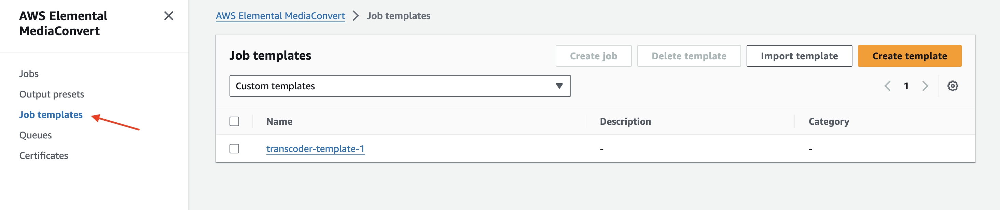

# Adaptive Bitrate
Project is about implementation of adaptive bitrate streaming to stream videos while adjusting the bitrate transfer of video segments for continuous buffering of video. It helps in better user experience by dynamically adjusting bitrate transfer on the basis of user's network condition.
## Transfer Protocol
Common file transfer protocols:
- **HLS(HTTP Live Streaming):** Developed by Apple, widely used by IOS devices.
- **MPEG-DASH(Dynamic Adaptive Streaming over HTTP):** An open standard, widely used by different platforms
- **Microsoft Smooth Streaming:** Developed by Microsoft, widely used for Microsoft environment.
- **CMAF (Common Media Application Format):** Joint contribution by Apple, Microsoft, MPEG, etc. for standardisation and low latency solution for HLS and MPEG-DASH both.

In this project, we are mainly looking at using HLS Protocol for Adaptive bitrate file transfer over the network.
## High Level Design
Key components for file streaming service:
- **Server:** Main servers that manages hosting and streaming of video.
- **Client:** User which streams the video on their device. It can be on website or mobile app. They are also the one who uploads it.
- **CDN:** Geographical distributed system to bring file content near to end user.
- **Protocol:** We are focusing HLS based file transfer protocol.
- **Database:** To store details and content of file.

### HLS Protocol
To make dynamic switching between different bitrates based on user's network condition, Transcoding of the file is needed into smaller chunks. Key components:
- **Segments:** File is divided in small chunks, typically into 6-10 seconds. They are requested and buffered individually, making the streaming smooth as there will be continuous fetching of these chunks, instead one-time buffer/download of whole video. These chunks can help in switching between different quality of video on the basis of network condition.
- **Manifest:** Main .m3u8 file that contains all the information of different chunks. It helps in identifying the chunk by bandwidth, resolution, codecs, etc.

### Server
Server can be divided into different components:
- **Front-End:** That will help in hosting the website to upload and stream the video content.
- **Backend-Server:** That will help in upload and processing of video file.
- **File Storage:** That will save the raw file, along with the processed file. E.g. AWS S3.
- **Database:** To save file related information, to retrieve file from file storage. It can be SQL/No-SQL, depending upon usage, but we are going to use serverless No-SQL AWS DynamoDB.
## Low Level Design
Let us deep dive into scaling of application.
### Upload scaling
There is an issue of uploading large files in go as there can be limit in http request size, server bandwidth(e.g. nginx, load balancer, server size). To overcome these challenges, front-end can divide file into smaller chunks(e.g. 10MB) to utilize the multipart upload feature of S3 upload. Multipart upload is divided into 3 parts:
- **Initiation:** Initiation of multipart upload. Which provides uploadId to upload parts of file.
- **Parts Upload:** Divide the file into multiple parts(e.g.10MB) size and send it by multipart/form-data http call.
- **Completion:** Sum up all the parts by providing details of each individual part upload.
### Transcoding Scaling
We need a queue and server to off-load the Transcoding task to scale and reduce server load. We are going to use **AWS Elemental MediaConvert** to queue and transcode video. Following process needs to be done:
- **Queue:** It will push the job to transcode the file. We are going to use the Default queue in this project.
- **Template:** We need to create job template to use the transcoding specification in our code. We can also create the same template specification by using code itself.
### File Storage
We have 2 types of file, ie raw and transcode. We need to create 2 separate buckets on the for file storage, ie private bucket and public bucket. **Private bucket** is needed to restrict upload of file to S3, by using Authorisation(However, project doesn't have that part yet). **Public bucket** is needed for transcoding files to provide streaming access with get-object public permission.
## API Reference

### Initiate Multipart upload
It is a POST method with Json-formatted body to initiate multipart upload request.

```http
  POST /video/multipart/v1/initiate
```

| Parameter     | Type       | Description                    |
|:--------------|:-----------|:-------------------------------|
| `fileName`    | `String`   | Original name of the file      |
| `fileSize`    | `Long`     | Original size of the file      |
| `contentType` | `String`   | Original meme type of the file |

#### Example
```sh
curl --location 'http://localhost:8080/video/multipart/v1/initiate' \
--header 'Content-Type: application/json' \
--data '{
    "fileName":"2836305-uhd_3840_2160_24fps.mp4",
    "fileSize":79154343,
    "contentType":"video/mp4"
}'
```

#### Success Response Body
```json
{
    "fileKey":"e8347800-0015-423a-8adc-ed31774f4641",
    "uploadId":"VBy6SYiYsP0WaiPrCBmvOUvbahdgTXj4zs8.wFqhlHanT.PZvGuMXNoSuRbcXC2DKNSx6XTB_ZXu4F3_0DaBf8oGexD2ySc4aECq9zizU5A28JI4F72sfR13nGWdPQJA"
}
```

### Multipart Upload - Parts
It is an upload http call with several bifurcated parts of large file. It is a multipart/form-data request.

```http
  POST /video/multipart/v1/upload
```

| Parameter    | Type       | Description                               |
|:-------------|:-----------|:------------------------------------------|
| `file`       | `File`     | File Content                              |
| `fileKey`    | `String`   | fileKey that is received while initiation |
| `partNumber` | `String`   | Part Number of bifurcated file            |
| `isLast`     | `String`   | to identify if this part is last part     |

#### Example
```sh
curl --location 'http://localhost:8080/video/multipart/v1/upload' \
--form 'file=@"/Users/user/Downloads/2836305-uhd_3840_2160_24fps.mp4"' \
--form 'fileKey="e8347800-0015-423a-8adc-ed31774f4641"' \
--form 'partNumber="2"' \
--form 'isLast="false"'
```

#### Success Response Body
```json
{
    "partNumber":"2",
    "eTag":"67531b174a47ca707a2a87865e480859"
}
```

### Complete Multipart upload
It is a POST method with Json-formatted body to Complete and compile all parts of bifurcated uploads into 1 file.

```http
  POST /video/multipart/v1/complete
```

| Parameter         | Type        | Description                                                                                        |
|:------------------|:------------|:---------------------------------------------------------------------------------------------------|
| `fileKey`         | `String`    | fileKey that is received while initiation                                                          |
| `eTagDetailArray` | `JsonArray` | Array of eTag details of all parts that were received in response during upload of different parts |

#### Example
```sh
curl --location 'localhost:8080/video/multipart/v1/complete' \
--header 'Content-Type: application/json' \
--data '{
    "fileKey": "e8347800-0015-423a-8adc-ed31774f4641",
    "eTagDetailArray": [
        {
            "partNumber": 1,
            "eTag": "31a566b3b656491010ce7106eff481d3"
        },
        {
            "partNumber": 2,
            "eTag": "67531b174a47ca707a2a87865e480859"
        },
        {
            "partNumber": 3,
            "eTag": "d40ecdbcb33edc5879987cfb9fce338d"
        },
        {
            "partNumber": 4,
            "eTag": "a66cc464cff7053c53b45ef4a672ae65"
        },
        {
            "partNumber": 5,
            "eTag": "552f22f28ffbda3f3981e5a1a2fe276e"
        },
        {
            "partNumber": 6,
            "eTag": "9fb6987aaf935be8e211a195fb19aa60"
        },
        {
            "partNumber": 7,
            "eTag": "86aff8db3d550cee2b6824e56ba5c165"
        },
        {
            "partNumber": 8,
            "eTag": "5b5711d82e4d41ebca9195c7c06f063f"
        }
    ]
}'
```
#### Success Response Body
```json
{
    "fileKey":"e8347800-0015-423a-8adc-ed31774f4641",
    "transcodeJobId":"1719157993658-r5b8ps",
    "transcodePath":"public-bucket/hls_test/289fc043-b73b-4f70-a374-57012383ae92/index"
}
```

### Transcoding Status Check
It is a GET method with Json-formatted body to check transcoding status.

```http
  POST /video/transcoding/v1/status/{transcodingId}
```

| Parameter       | Type       | Description                                                     |
|:----------------|:-----------|:----------------------------------------------------------------|
| `transcodingId` | `String`   | transcodeJobId that we received from complete multipart request |

#### Example
```sh
curl --location 'localhost:8080/video/transcoding/v1/status/1719157993658-r5b8ps'
```

#### Success Response Body
```json
{
    "status":"PROGRESSING"
}
```

## Demo
This project already contains some template.
### Template Setup
There is a sample job template that can help in creating Job template. Steps:
1. Go to AWS Elemental MediaConverter.
2. Select Job Templates on the left menu. 
3. Select Import Template option on the top-right side. 
4. Select the sample json that is saved in demo/jobTemplate/aws-mediaconvert-template-transcoder-template-1.json.

Or You can Select Create Template to create template from scratch and refer to standard resolutions. Steps to create new template:
1. Select Create Template in Job Templates.
2. Fill Out the Template Information.
3. Click on ADD option in Output groups.
4. Select Apple HLS.
5. Keep Default settings for now and create output manifests for different resolutions for transcoding by adding Outputs in the last. Also add manifest name modifier for each resolution
6. After adding these output, we can see them added in the output groups section in left side. Now go to each section and update settings.
7. By keeping default settings and changing only 3 things in each group, we can modify manifests file for usage. Settings might differ
8. Create Job template by choosing Select button in the bottom-right.
9. Now need to create MediaConverter role to use and connect it with S3. By adding 2 Permissions, i.e. AmazonAPIGatewayInvokeFullAccess and AmazonS3FullAccess.

| Output Manifest | Width | Height | Max Bitrate |
|-----------------|-------|--------|-------------|
| _1080p          | 1920  | 1080   | 5000000     |
| _720p           | 1280  | 720    | 2500000     |
| _480p           | 850   | 480    | 1200000     |

### Front-End Demo Code
#### Uploading
For uploading sample html and javascript file is provided in demo/uploading.
#### Player
After Transcoding, final output can be played through a sample player html file (demo/hlsPlayer/hls_try.html) after changing the url by getting it from final m3u8 S3 url. After opening the final index.m3u8 file, open it and get the url.


